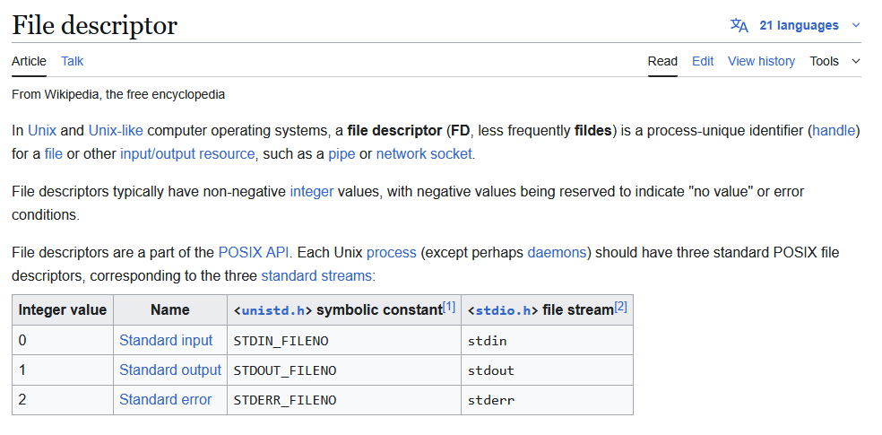

# Challenge #1 - fd

## Challenge Description:
>
> Mommy! what is a file descriptor in Linux?
>
> * try to play the wargame your self but if you are ABSOLUTE beginner, follow this tutorial link:
> https://youtu.be/971eZhMHQQw
>
> ```bash
> ssh fd@pwnable.kr -p2222 (pw:guest)
> ```

---

## Pre-Analysis
Right, before doing anything else, let's check to see what exactly we are working with.

```bash
fd@ubuntu:~$ ls -l
total 24
-r-xr-sr-x 1 root fd_pwn 15148 Mar 26 13:17 fd
-rw-r--r-- 1 root root     452 Mar 26 13:17 fd.c
-r--r----- 1 root fd_pwn    50 Apr  1 06:06 flag
```

Let's run `file` and `checksec` quickly to examine our executable (This isn't needed in this challenge but a good habit)

```bash
fd@ubuntu:~$ file fd && checksec fd
fd: setgid ELF 32-bit LSB pie executable, Intel 80386, version 1 (SYSV), dynamically linked, interpreter /lib/ld-linux.so.2, BuildID[sha1]=156ca9c174df927ecd7833a27d18d0dd5e413656, for GNU/Linux 3.2.0, not stripped
[!] Could not populate PLT: Cannot allocate 1GB memory to run Unicorn Engine
[*] '/home/fd/fd'
    Arch:       i386-32-little
    RELRO:      Full RELRO
    Stack:      No canary found
    NX:         NX enabled
    PIE:        PIE enabled
    Stripped:   No
```

OK, so we have our flag file and corresponding C source code and 32-bit ELF. However, we only have read permissions over `fd` and `fd.c`.

## Static Analysis
Lets examine `fd.c`:

```C
#include <stdio.h>
#include <stdlib.h>
#include <string.h>
char buf[32];
int main(int argc, char* argv[], char* envp[]){
        if(argc<2){
                printf("pass argv[1] a number\n");
                return 0;
        }
        int fd = atoi( argv[1] ) - 0x1234;
        int len = 0;
        len = read(fd, buf, 32);
        if(!strcmp("LETMEWIN\n", buf)){
                printf("good job :)\n");
                setregid(getegid(), getegid());
                system("/bin/cat flag");
                exit(0);
        }
        printf("learn about Linux file IO\n");
        return 0;

}
```
Okay we have a `main` function that:
1. Checks if the caller provided at-least 1 command line argument (the first one is always the program's name)
2. If not, prints to the console and exits
3. If yes, it converts it to an integer with `atoi` and subtracts `0x1234` (Decimal: 4660) from it
4. Then it reads from the result serving as a file descriptor
5. It reads 32 bytes from it and compares it using `strcmp` to `"LETMEWIN\n"`
6. if the read string is identical it continues and gives us our flag!
7. If not, it exits

## Plan

OK, now that we know what the program does we can exploit it to get the flag!

If we take the hint to learn about linux IO we see there are a couple unique file descriptors:



The one we should pay our attention to is `stdin`, it describes whatever the user writes into the terminal window. That means we have complete control over it!

In that case, the exploit is clear:
- Put 4660 as a command-line argument so that `fd` becomes 0 (Recall program step 3)
- That gives up control on what the program reads
- Enter LETMEWIN and then press enter (`'\n'`)
- We get the flag!

## Exploit

Lets try our plan:

```bash
fd@ubuntu:~$ ./fd 4660
LETMEWIN
good job :)
<fd_flag_here>
fd@ubuntu:~$
```

### And we are successful!
